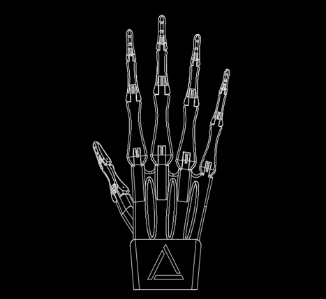
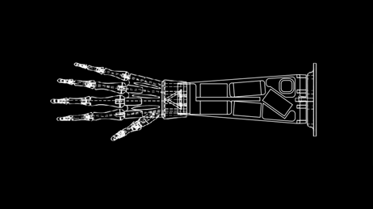

 

  

<h2 align="center">G.H.O.S.T. Robotic Hand</h3>

  

    A self designed DIY 3D-printed robotic hand built to test and explore control strategies and human gripping.
     
  

<!-- TABLE OF CONTENTS -->

  
Table of Contents

  <ol>
    <li>
      <a href="#about-the-project">About The Project</a>
      <ul>
        <li><a href="#built-with">Built With</a></li>
      </ul>
    </li>
    <li>
      <a href="#getting-started">Getting Started</a>
      <ul>
        <li><a href="#prerequisites">Prerequisites</a></li>
        <li><a href="#installation">Installation</a></li>
      </ul>
    </li>
    <li><a href="#usage">Usage</a></li>
    <li><a href="#roadmap">Roadmap</a></li>
    <li><a href="#contributing">Contributing</a></li>
    <li><a href="#license">License</a></li>
    <li><a href="#contact">Contact</a></li>
    <li><a href="#acknowledgments">Acknowledgments</a></li>
  </ol>

<!-- ABOUT THE PROJECT -->
## About The Project

  

Here's a blank template to get started: To avoid retyping too much info. Do a search and replace with your text editor for the following: `lklostermair`, `G.H.O.S.T.-Robotic-Hand`, `twitter_handle`, `lukasklostermair`, `email_client`, `email`, `G.H.O.S.T.-Robotic-Hand`, `A self designed DIY 3D-printed robotic hand built to test and explore control strategies and human gripping.`

(<a href="#readme-top">back to top</a>)

### Built With

* 

(<a href="#readme-top">back to top</a>)

<!-- GETTING STARTED -->
## Getting Started

I started working on my project after my bachelors. After finishing a engineering degree, I wanted to apply my knowledge to a real world use case. I found hands particularily interesting as they are one of the most complex mechanisms for robots to copy. After reading up on different DIY projects, projects such as the [[ETH Hand](https://www.youtube.com/watch?v=3SUpe5RBC70)] and state of the art research i decided to build a tendon based robotic hand. To keep it simple i just wanted to perform opening and closing of all 5 fingers, with the thumb rotated to enable grasping. For christmas, I got an Arduino kit to kick off my project.

The design was inspired by this [Video][Video] as I really liked the creepy look the hand had, and it reminded me of a halloween bowl we used to use for trick or treating, that had a hand sticking out of it as well as a proximity sensor that would make the hand move as soon as somebody put their hand in.

After designing one finger, I printed it to try it out.
I found out that the finger hyperextends, as contrary to its real world counter part, it's tendon length is not limited. Therefore i built in a "stop" so it can not hyperextend. AFter reprinting and retrying, I was happy with the movement and began printing all 5 fingers as well as the hand palm.

Positioning the servos in the lower arm was the next difficulty, as I wanted to have the servos visible and to some degree level. I printed two versions of the lower arm panel, with elevations for the servos to ensure they don't interfere with each other. I then attached them back two back and had a 3D setup for the servos.

### CAD

I designed the project from scratch in Fusion 360. It's free for students and for the rather shallow complexity of my project it was perfect! I am pretty good in working with CATIA, but it was new for me to work within Fusion. During this prototyping phase the correct workflow with the right dependencies was not that high of a priority for me. I later noticed I should have looked more into it, as I had a hard time adapting my existing models to differing geometries (e.g. increasing the size of the tendon holes).

(<a href="#readme-top">back to top</a>)

### 3D printing

All the 3D printed parts were printed with PETG in an Anycubic Mega S printer. As it also was the first time for me working with this printer, I had to work through a series of configurations (making alot of them famous boaties :D) until I had found some that work sufficiently for my use case. A big challenge were the rather small channels for the "tendons" in the fingers. As I simply scaled the CAD model to fit the finger size, the pinkie finger was the most difficult to work with.

(<a href="#readme-top">back to top</a>)

## Soldering and Electronics

(<a href="#readme-top">back to top</a>)

## Movement

(<a href="#readme-top">back to top</a>)

## Control

After implementing a script, that runs on the Arduino by itself, I wanted to control the hand movements with an external controller. For this i built a glove with flexion sensors, that communicates with the hand through an NRF module.
At first, due to budget reasons, I built myself flexion sensors as described in this [VIDEO][videolink]. Although they all worked to some degree, I was only able to extract a 1 or 0 signal, as they were not reliable enough to register a partial flexion of the fingers. I finally caved in and bought myself 5 flexion sensors.

(<a href="#readme-top">back to top</a>)

## Next Steps

Empowered with AI!! jk jk, but as a little case study, I would like to implement a neural network that recognizes gestures (more accurately: recognizes which fingers are extended) and transmits this info to the hand, which copies the movement.

(<a href="#readme-top">back to top</a>)

## Usage

Use this space to show useful examples of how a project can be used. Additional screenshots, code examples and demos work well in this space. You may also link to more resources.

_For more examples, please refer to the [Documentation](https://example.com)_

(<a href="#readme-top">back to top</a>)

<!-- LICENSE -->
## License

Distributed under the MIT License. See `LICENSE.txt` for more information.

(<a href="#readme-top">back to top</a>)

<!-- ACKNOWLEDGMENTS -->
## Acknowledgments

* 
* 
* 

(<a href="#readme-top">back to top</a>)

<!-- MARKDOWN LINKS & IMAGES -->
<!-- https://www.markdownguide.org/basic-syntax/#reference-style-links -->
[contributors-shield]: https://img.shields.io/github/contributors/lklostermair/G.H.O.S.T.-Robotic-Hand.svg?style=for-the-badge
[contributors-url]: https://github.com/lklostermair/G.H.O.S.T.-Robotic-Hand/graphs/contributors
[forks-shield]: https://img.shields.io/github/forks/lklostermair/G.H.O.S.T.-Robotic-Hand.svg?style=for-the-badge
[forks-url]: https://github.com/lklostermair/G.H.O.S.T.-Robotic-Hand/network/members
[stars-shield]: https://img.shields.io/github/stars/lklostermair/G.H.O.S.T.-Robotic-Hand.svg?style=for-the-badge
[stars-url]: https://github.com/lklostermair/G.H.O.S.T.-Robotic-Hand/stargazers
[issues-shield]: https://img.shields.io/github/issues/lklostermair/G.H.O.S.T.-Robotic-Hand.svg?style=for-the-badge
[issues-url]: https://github.com/lklostermair/G.H.O.S.T.-Robotic-Hand/issues
[license-shield]: https://img.shields.io/github/license/lklostermair/G.H.O.S.T.-Robotic-Hand.svg?style=for-the-badge
[license-url]: https://github.com/lklostermair/G.H.O.S.T.-Robotic-Hand/blob/master/LICENSE.txt
[linkedin-shield]: https://img.shields.io/badge/-LinkedIn-black.svg?style=for-the-badge&logo=linkedin&colorB=555
[linkedin-url]: https://linkedin.com/in/lukasklostermair
[Laravel-url]: https://laravel.com
[Bootstrap.com]: https://img.shields.io/badge/Bootstrap-563D7C?style=for-the-badge&logo=bootstrap&logoColor=white
[Bootstrap-url]: https://getbootstrap.com
[JQuery.com]: https://img.shields.io/badge/jQuery-0769AD?style=for-the-badge&logo=jquery&logoColor=white
[JQuery-url]: https://jquery.com 
